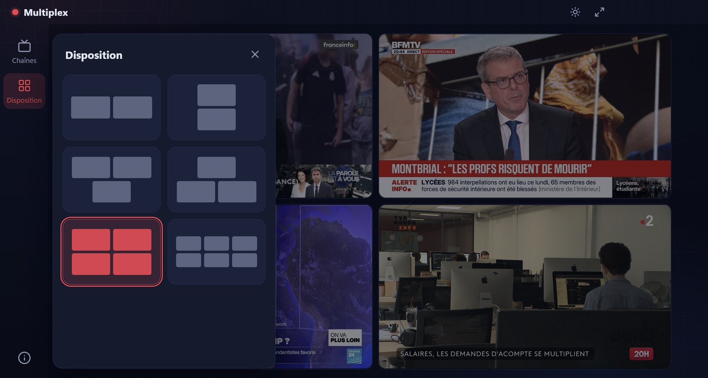

# Multiplex

[](https://github.com/Nyco87/Multiplex/actions/workflows/release.yml)
[](LICENSE)

<p align="center">
  
</p>

Mur d'images des chaînes d'information francophones, pour Windows.

Multiplex affiche simultanément de 2 à 6 directs (franceinfo, BFMTV, France 24, TV5Monde Info, Euronews, ICI RDI, i24NEWS…) dans une mosaïque en 16/9. Les flux démarrent seuls et restent muets. Un clic sur l'un d'eux l'affiche en grand, avec le son.

## Fonctionnalités

- **6 dispositions**, de 2 à 6 flux.
- **15 chaînes** francophones d'Europe, d'Afrique, du Canada et du Moyen-Orient, lues depuis leurs sources officielles (HLS, YouTube, Dailymotion), avec bascule automatique vers une source de secours.
- **Flux en grand** : clic ou touches `1` à `6`. Les autres flux passent en miniatures.
- **Réordonnancement** des flux par appui long, puis glisser-déposer.
- **Plein écran** immersif (`F11`).
- **Thèmes** clair et sombre.
- **Mémorisation** de la disposition, des chaînes et du thème.
- **Raccourcis clavier** : `H` pour les afficher.

## Aperçu

**Mosaïque de 4 flux (2 × 2)**


**Panneau Disposition**



**Flux en grand, dans la disposition à 6 flux (3 × 2)** : les autres flux passent en miniatures à gauche.


Le comportement détaillé est décrit dans la [spécification](docs/SPEC.md), et l'historique des décisions dans le [plan et journal](docs/PLAN.md).

## Installation

Téléchargez `Multiplex Setup x.y.z.exe` depuis la page [Releases](https://github.com/Nyco87/Multiplex/releases), puis lancez-le.

L'installeur n'est pas signé. Windows SmartScreen peut donc afficher « Windows a protégé votre ordinateur ». Cliquez sur **Informations complémentaires**, puis sur **Exécuter quand même**.

## Développement

Prérequis : Node.js 24 et npm.

```bash
npm ci
```

| Commande | Rôle |
|---|---|
| `npm run dev` | Lance l'application en mode développement, avec rechargement à chaud. |
| `npm test` | Lance les tests unitaires (Vitest). |
| `npm run typecheck` | Vérifie les types TypeScript. |
| `npm run check-streams` | Vérifie que chaque source du catalogue répond. |
| `npm run build:win` | Produit l'installeur Windows dans `dist/`. |

### Structure

```
src/main/        processus principal Electron : fenêtre, protocole app://, en-têtes réseau
src/preload/     pont minimal entre le processus principal et l'interface
src/renderer/    interface React
  data/          catalogue des chaînes (channels.json)
  assets/logos/  logos des chaînes
  components/    barre latérale, panneaux, scène, tuiles, lecteurs
  layout/        calcul de la géométrie des dispositions
  store/         état global persistant (zustand)
scripts/         vérification des flux, collecte des licences tierces
```

Les licences des bibliothèques embarquées sont collectées dans `node_modules` à chaque build. Elles sont affichées dans le panneau À propos de l'application.

## Publier une version

La publication est automatisée par GitHub Actions ([`release.yml`](.github/workflows/release.yml)). Seul un **tag `v*`** la déclenche : un push simple sur `main` ne lance rien.

1. Mettez à jour la version : `npm version 1.1.0`. Cette commande modifie `package.json`, crée le commit et le tag `v1.1.0`. Pour la première version (1.0.0, déjà dans `package.json`), créez seulement le tag : `git tag v1.0.0`.
2. Poussez le commit et le tag :

   ```bash
   git push --follow-tags
   ```

3. Le workflow vérifie que le tag correspond à la version de `package.json`. Il lance ensuite les tests, construit l'installeur et le dépose dans une **release brouillon**.
4. Sur la page [Releases](https://github.com/Nyco87/Multiplex/releases), relisez le brouillon, rédigez les notes, puis cliquez sur **Publish release**.

Le workflow peut aussi être lancé à la main, depuis l'onglet **Actions** (« Run workflow »). Il construit alors l'installeur sans rien publier, et le dépose en artefact du run.

## Mentions légales

Multiplex ne stocke ni ne retransmet aucun contenu : chaque flux est lu directement depuis la source officielle publiée par la chaîne. Les programmes, flux, noms et logos appartiennent à leurs chaînes respectives, qui en détiennent tous les droits. Multiplex n'est affilié à aucune de ces chaînes et n'est approuvé par aucune d'elles.

## Licence

Le code de Multiplex est distribué sous [licence MIT](LICENSE). © 2026 Nicolas Morellet.

Cette licence couvre uniquement le code. Les noms et logos des chaînes, dans `src/renderer/assets/logos/`, sont des marques de leurs détenteurs respectifs, et n'en relèvent pas.
